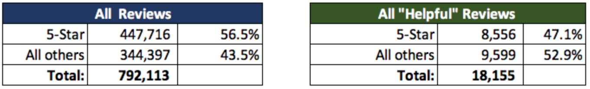
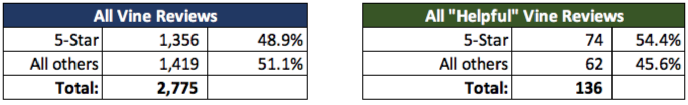
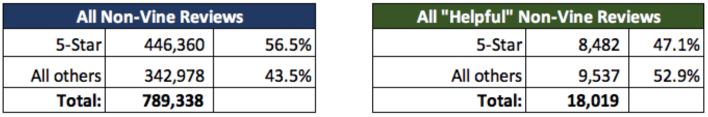
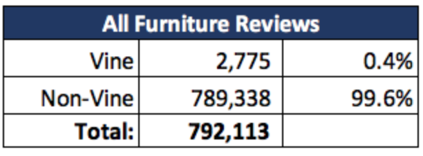
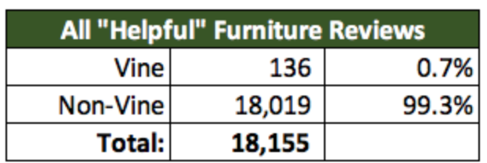
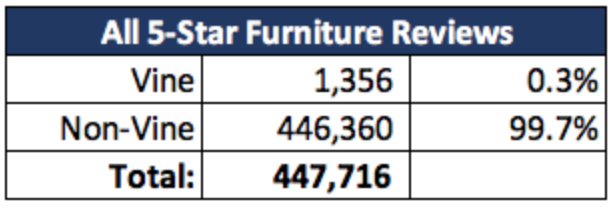
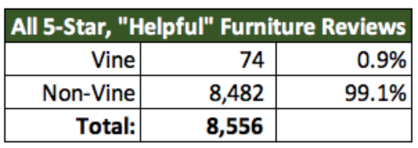

# Amazon_Vine_Analysis

# Deliverable 1: Perform ETL on Amazon Product Reviews

**Deliverable 1 Requirements**

- The Amazon_Reviews_ETL.ipynb file does the following:

  - An Amazon Review dataset is extracted as a DataFrame
  - The extracted dataset is transformed into four DataFrames with the correct columns
  - All four DataFrames are loaded into their respective tables in pgAdmin

# Deliverable 2: Determine Bias of Vine Reviews

**Deliverable 2 Requirements**

- The analysis does the following:

  - There is a DataFrame or table for the vine_table data using one of three methods above
  

  - The data is filtered to create a DataFrame or table where there are 20 or more total votes

  - The data is filtered to create a DataFrame or table where the percentage of helpful_votes is equal to or greater than 50%
 

  - The data is filtered to create a DataFrame or table where there is a Vine review

  - The data is filtered to create a DataFrame or table where there isn’t a Vine review

  - The total number of reviews, the number of 5-star reviews, and the percentage 5-star reviews are calculated for all Vine and non-Vine reviews

# Deliverable 3: A Written Report on the Analysis

**Deliverable 3 Requirements**

The written analysis has the following:

- Overview of the analysis of the Vine program:

- Results:
        - There is a bulleted list that addresses the three questions for unpaid and paid program reviews
      
1.  99.6% are Non-Vine.
    
2.  99.7% of all 5-star reviews are non-Vine.
    
3.  Not all of the 5 Star reviews are coming from Vine participants.

        
- Summary:
        - The summary states whether or not there is bias, and the results support this statement
        
        - An additional analysis is recommended to support the statement
        
